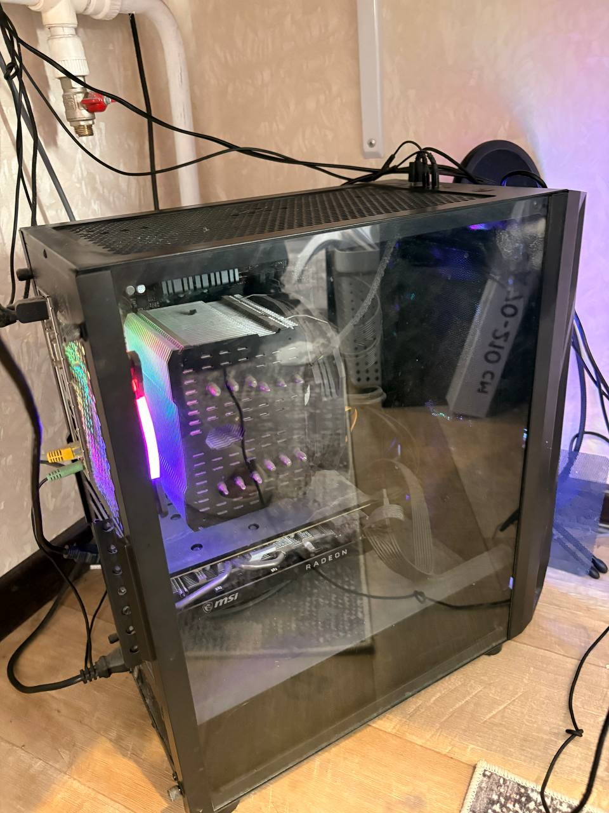
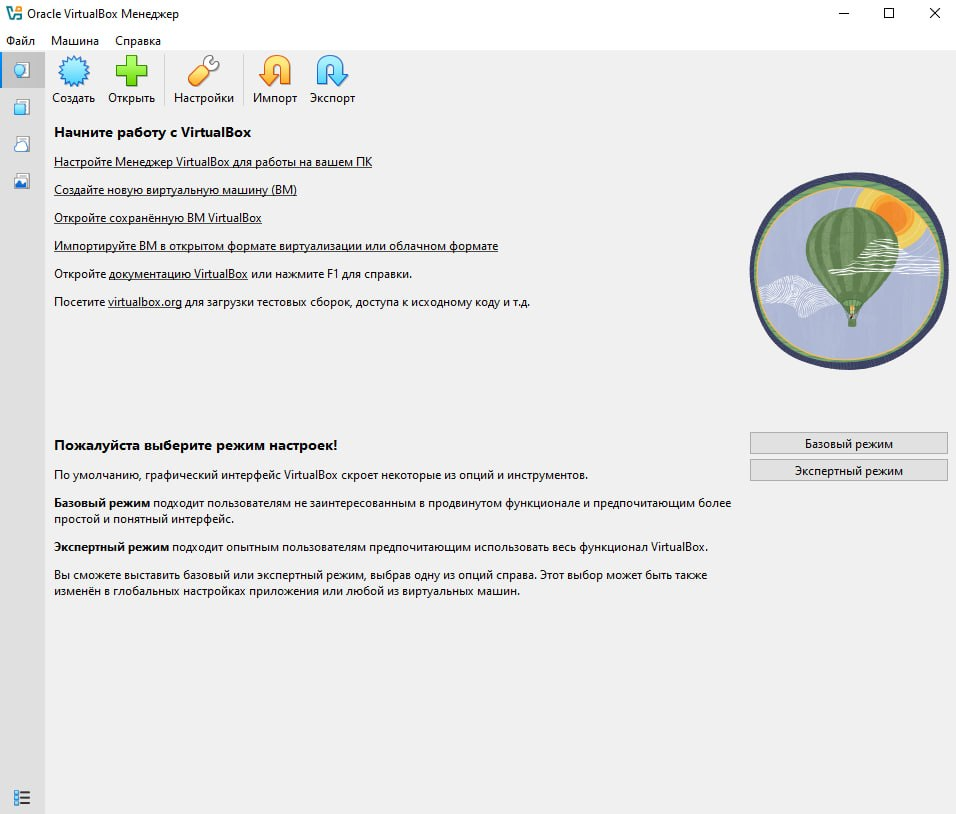
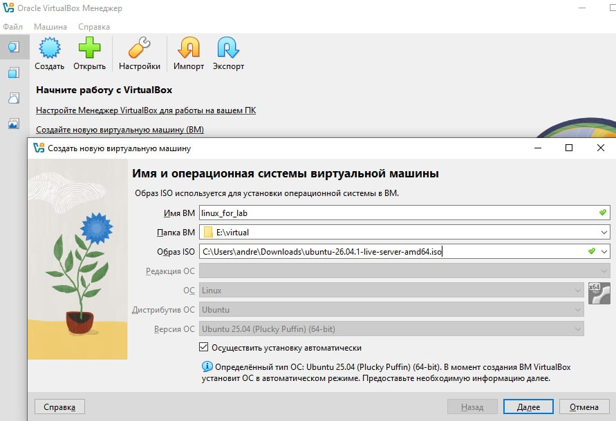
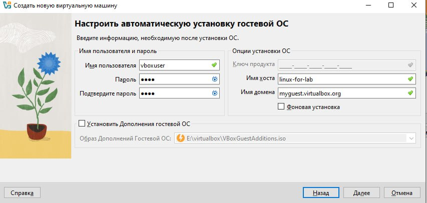
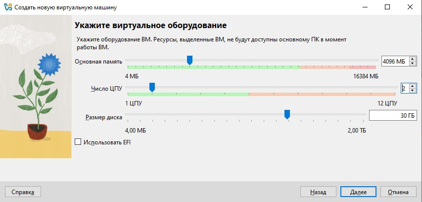
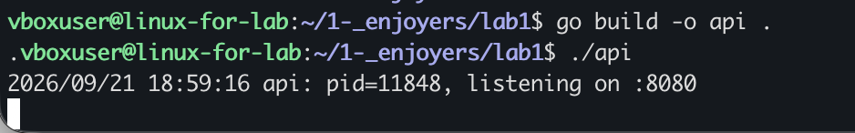

Отчет по лабораторной

Для начала работы, был написан сервер

Далее, так как на макос не хватало памяти, я развернул виртуальную машину на винде, установил туда виртуал бокс и обеспечил соединение по ssh для удобной работы с мака

Мой стационарный компьютер, который используется как сервер

скачал образ убунту сервер 26.6 , ubuntu 25.04

далее, были заданы параметры виртуальной машины

было настроено автоматическое создание гостевой ос

далее были указаны параметры виртуальной машины, cpu, память и размер диска

далее, ubuntu была установлена

затем настроен ssh

и установлен tailscale для обеспечения соединения

установка tailscale мне показалась неправильной и решил поискать другой альтернативный способ, тк там надо было авторизовывать разные устройства по почте, решил поискать другие варианты решения этой проблемы , в результате пришел к yggdrasil, установил на оба устройства, добавил пиры и установил подключение по ssh, все заработало без сторонних авторизаций и сервисов

Далее, написанный сервис был скомпилирован и запущен

